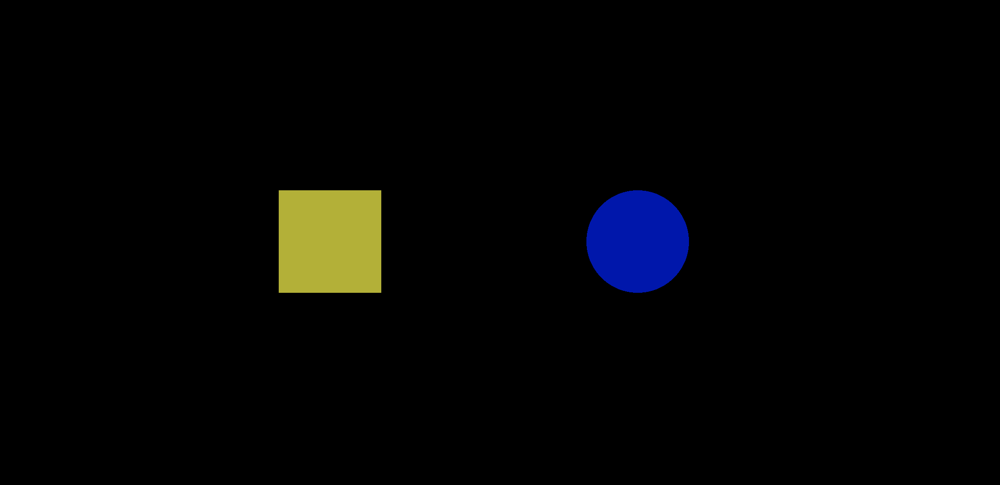
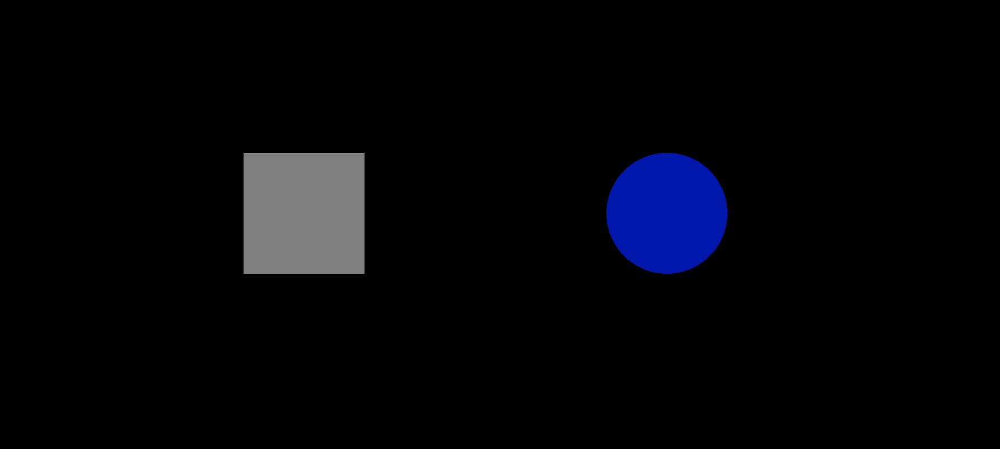
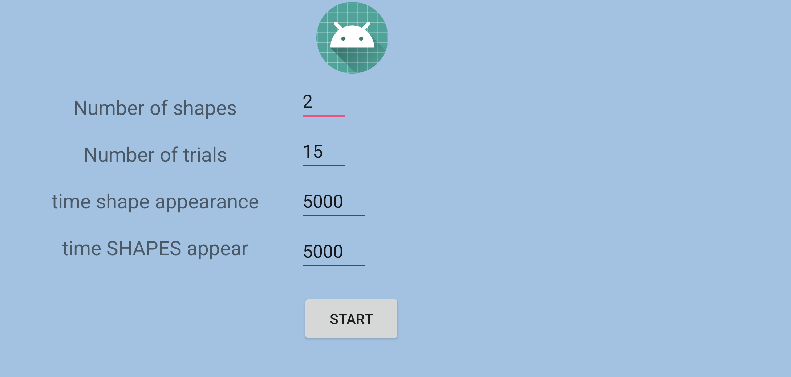

# Development and Implementation of a Javascript-Based Reaction Task for Studying Parkinson's Disease in Monkeys

As part of my research project at the Grenoble Institute of Neuroscience (GIN), I developed an experimental task in Javascript designed to assess reaction capabilities in monkeys, both with and without Parkinson's disease.

This task, integrated into a tablet connected to a reward system, allows for the measurement of the monkeys' performance based on their ability to respond to visual stimuli. Specifically, when the monkey correctly presses the target shape displayed on the screen, it receives a reward in the form of syrup, the quantity of which is predefined.

<p align="center">
  
  
</p>

Before each session begins, the researcher can adjust several experimental variables, such as the duration of stimulus presentation and the number of shapes displayed. These adjustments enable the experiment to be tailored to the specific needs of the study, allowing for precise evaluation of the impact of Parkinson's disease on the cognitive and motor abilities of the subjects.

<p align="center">
  
</p>

here's the function to find out where the monkey has clicked and if it has clicked on a shape

```javascript
public boolean onTouchEvent(MotionEvent e){

        // get coordinates of user input
        float x = e.getX();
        float y = e.getY();

        // coordinate of the center of the screen
        float centerX = 1.5f;
        float centerY = 1.0f;
        float[] miniSquare = {0.0f,0.0f,0.0f,0.0f};

        // get the time of user input
        ResponseTimeMillis = System.currentTimeMillis()-timeZero;

        switch(clickForm){
            case "square":
                mSquare.color = new float[]{0.5f, 0.5f, 0.5f, 1.0f};
                miniSquare =new float[] {centerX-0.1f+translation[0],centerX+0.095f+translation[0],centerY-0.1f,centerY+0.2f};
                break;
            case "circle":
                mCircle.color = new float[]{0.5f, 0.5f, 0.5f, 1.0f};
                miniSquare =new float[] {centerX-0.1f+translation[1],centerX+0.095f+translation[1],centerY-0.1f,centerY+0.2f};
                break;
            case "triangle":
                mTriangle.color = new float[]{0.5f, 0.5f, 0.5f, 1.0f};
                miniSquare =new float[] {centerX-0.1f+translation[2],centerX+0.095f+translation[2],centerY-0.1f,centerY+0.2f};
                break;
        }

        // declaration and initialization of variables to find the square on the screen
        // Formula must be adjusted for each drawn object
        // according to the OpenGL coordinate system
        float squareXLeft = (((-squareX) + miniSquare[0]) / 3) * screenWidth;
        float squareXRight = (((-squareX) + miniSquare[1]) / 3) * screenWidth;
        float squareYBottom = (((squareY) + miniSquare[2]) / 2) * screenHeight;
        float squareYTop = (((squareY) + miniSquare[3]) / 2) * screenHeight;

        switch (e.getAction()){
            case MotionEvent.ACTION_DOWN:
                // If ACTION_DOWN is triggered, check if square got touched
                if ((x > squareXRight || x < squareXLeft || y > squareYTop || y < squareYBottom )&& i%3==0){
                    touchedNothing();
                }
                else if (x <= squareXRight && x >= squareXLeft && y <= squareYTop && y >= squareYBottom){
                    touchedObject();
                    mGLView.requestRender();

                }
        }
        return false;
    }
```
